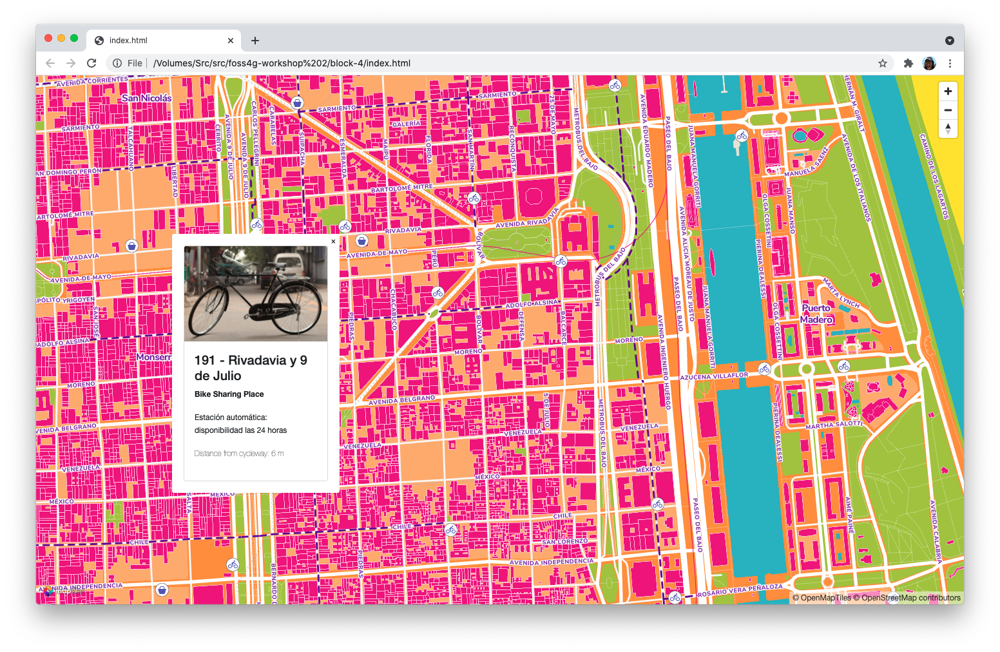
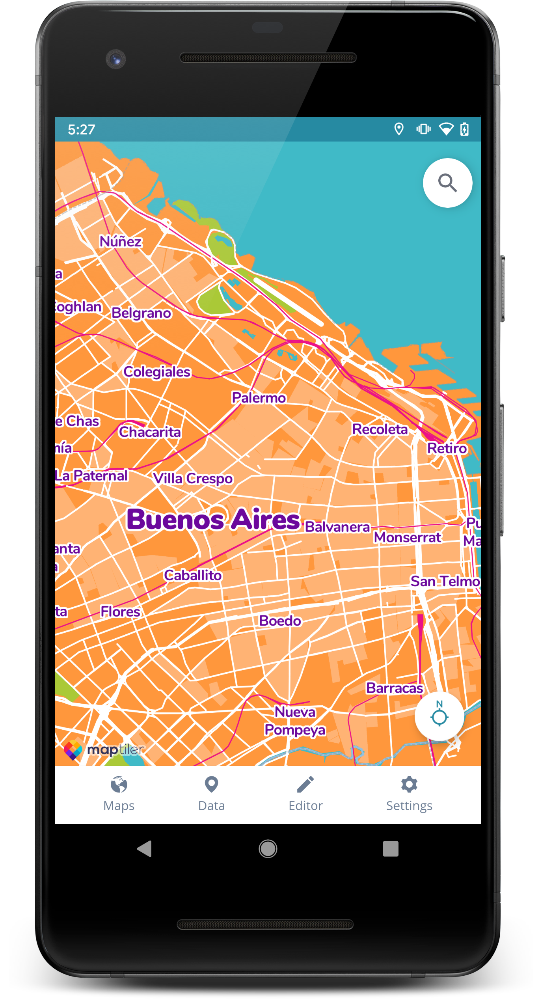

# foss4g-workshop
Repository for From your data to vector tiles in your web&amp;mobile app workshop at FOSS4G 2021, Buenos Aires

This README will guide you through the workshop step by step.
The goal of the workshop is to have a web application with 
map showing cycleways in the center of Buenos Aires. There will
be also POIs - bike shops and bike sharing stations - with pop-ups
displaying some additional information about the POI. The map will be
in a theme of FOSS4G 2021.

## Intro - setup tools

- Docker, docker-compose
  - Installation guide
    - https://docs.docker.com/get-docker/
    - https://docs.docker.com/compose/install/ 
  - Pull Docker images
    ```
    docker pull openmaptiles/postgis:5.3
    docker pull openmaptiles/import-data:5.3
    docker pull openmaptiles/openmaptiles-tools:5.3
    ```

- QGIS
  - Version 3.16 or later 
  - Installation guide at https://qgis.org/en/site/forusers/download.html
  - Including `qgis-grass-plugin`


- IDE
  - gedit, notepad, Sublime...


- MapTiler Cloud
  - https://cloud.maptiler.com
  - Sign-in with Google Account


- StackBlitz
  - https://stackblitz.com 
  - Sign-in with Google Account


- CloudShell
  - https://cloud.google.com/
  - Sign-in with Google Account

## Block 1 - Extract data from OpenStreetMap

### Project preparation
**Download 3.12.2 release**
```
mkdir foss4g
wget https://github.com/openmaptiles/openmaptiles/archive/refs/tags/v3.12.2.zip
unzip v3.12.2
mv openmaptiles-3.12.2 openmaptiles
```

**Download Buenos Aires city from OSM**
```
make download-osmfr area=south-america/argentina/buenos_aires_city
```
### Creating extra layer **cycleway**

- Create folder `cycleway` in `layers`

- Create empty files:
  - `mapping.yaml`
    - used by imposm (used by import-osm)
  - `cycleway.yaml`
    - used by OMT-T
  - `cycleway_merge.sql`
    - data pre-processing (during import-sql)
  - `cycleway.sql`
    - used by import-sql


### code for files
- [code for mapping.yaml](./block-1/cycleway/mapping.yaml)
- [code for cycleway.yaml](./block-1/cycleway/cycleway.yaml)
  - `id` - id of layer used in style
  - `buffer_size` - buffer around layer for rendering purposes - should be bigger for layers with labels
  - `fields` - attributes definition
  - `datasource` - definition of the layer sql function
  - `schema` - additional sql files that should be run
- [code for cycleway_merge.sql](./block-1/cycleway/cycleway_merge.sql)
- [code for cycleway.sql](./block-1/cycleway/cycleway.sql)

### project modification

**Modification of .env file**
 - `BORDERS_CLEANUP=true`
 - `MAX_ZOOM=14`

**Add cycleway.yaml into openmaptiles.yaml**
  - `layers/cycleway/cycleway.yaml`
  - `center: [0, 0, 10]`
  - `id: foss4g`

**modification of docker-compose.yml - postgres ports**
  - `"5432:5432"`

### import OSM into database
```
make clean
make

make import-borders
make import-data

make import-osm
make import-wikidata
```
 

## Block 2 - Add own data, analyse in QGIS & PostGIS


### 1. Add PostGIS connection to QGIS.

Go to Browser/PostGIS/New Connection…
- Name: osm_buenos_aires
- Host: localhost
- Port: 5432
- Database: openmaptiles
- User: openmaptiles
- Password: openmaptiles

Check you can see added `osm_cycleway_linestring` table. Go to Browser/PostGIS/osm_buenos_aires/public/osm_cycleway_linestring and
double-click on it. Cycleways should be added to map canvas.

### 2. Add basemap for context via MapTiler plugin

1. Go to Plugins/Manage and Install plugins.../All and search for `MapTiler`
2. Right-click on MapTiler in Browser and add API key `XorxtpkRV4o7B7Ssqzg6`
3. Add Streets map


### 3. Analyse bike shops (geojson) in QGIS

#### Add GeoJSON to QGIS

1. Download GeoJSON from https://dev.maptiler.download/foss4g/bicicleterias/bicicleterias-de-la-ciudad.geojson
2. Add GeoJSON to QGIS (drag and drop) 
3. Reproject data from WGS84 (EPSG:4326) to Pseudo-Mercator (EPSG:3857).
   1. Go to Processing toolbox/Vector general/Reproject layer
   2. Choose Input layer: `bicicleterias-de-la-ciudad bicicleterias_WGS [EPSG:4326]`
   3. Choose Target CRS: `EPSG:3857 - WGS 84/Pseudo-Mercator`
   4. Choose `[Create temporary layer]`
   5. Run

#### Add new attribute field
1. Open attribute table
2. Toggle editing
3. Add New field
   1. Name: distance
   2. Type: Integer
4. Save edits

#### Distance analysis
Go to Processing toolbox/GRASS/vector/v.distance 
 - from: Reprojected
 - to: osm_cycleway_linestring
 - upload: dist
 - column for upload: distance
 - Save to temporary file Nearest

#### Export 
Right-click on Nearest/Make Permanent
 - Format: GeoJSON
 - File name: `openmaptiles/data/bike_shops_w_distance.geojson`.

### 4. Import bike shops (geojson) to PostGIS

Processed GeoJSON available for download at: 
https://dev.maptiler.download/foss4g/bike_shops_w_distance/bike_shops_w_distance.geojson

Use `import-data` docker image to import the processed GeoJSON `bike_shops_w_distance.geojson into` 
PostGIS table `ba_bike_shops`.

```
cd openmaptiles
docker-compose run --rm -v $PWD:/omt import-data /bin/sh
ogr2ogr --version
ogr2ogr -f "PostgreSQL" PG:"dbname=openmaptiles" /omt/data/bike_shops_w_distance.geojson -nln ba_bike_shops
exit
```

You should be able to see the table `ba_bike_shops` in QGIS now.

### 5. Import Shapefile to PostGIS
1. Download zip file from https://dev.maptiler.download/foss4g/estaciones/estaciones-de-bicicletas-zip.zip
2. Extract zip file into `openmaptiles/data`.
3. Import shapefile to PostGIS.
```
cd openmaptiles
docker-compose run --rm -v $PWD:/omt import-data /bin/sh
ogr2ogr -f "PostgreSQL" PG:"dbname=openmaptiles" /omt/data/estaciones-de-bicicletas-zip/estaciones_de_bicicletas_WGS84.shp -nln ba_bike_sharing_stations -s_srs EPSG:4326 -t_srs EPSG:3857
exit
```

### 6. Analyse bike sharing stations in PostGIS

#### Add new table column
Either in QGIS/Database/DB Manager... or in psql console
Add column `distance` with integer type.
```
cd openmaptiles
make psql
\d ba_bike_sharing_stations
ALTER TABLE ba_bike_sharing_stations ADD COLUMN distance INTEGER;
\d ba_bike_sharing_stations
\q
```

#### Distance analysis
Either in QGIS/Database/DB Manager... or in psql console
```
cd openmaptiles
make psql
UPDATE ba_bike_sharing_stations AS b SET distance=(SELECT ST_Distance(b.wkb_geometry, c.geometry) FROM osm_cycleway_linestring AS c ORDER BY b.wkb_geometry <-> c.geometry LIMIT 1);
```

### 7. Add analysed data into OpenMapTiles schema as a new layer cycleway_poi

1. create new folder `cycleway_poi` in `layers` folder
2. create new files `cycleway_poi.yaml` and `cycleway_poi.sql`

#### Layer definition file
[cycleway_poi.yaml](./block-2/cycleway_poi/cycleway_poi.yaml)
- `id` - id of layer used in style
- `buffer_size` - buffer around layer for rendering purposes - should be bigger for layers with labels
- `fields` - attributes definition
- `datasource` - definition of the layer sql function
- `schema` - additional sql files that should be run


#### Layer sql function
[cycleway_poi.sql](./block-2/cycleway_poi/cycleway_poi.sql)
[cycleway_poi.sql](./block-2/cycleway_poi/cycleway_poi.sql)
- `CREATE FUNCTION layer_cycleway_poi(bbox geometry, zoom_level int)`
  - we want to create function with `bbox` and `zoom_level` as input params
- `RETURNS TABLE (name text, geometry geometry, class text, hours text, distance integer)`
  - function returns table with column `name`, `geometry`, `class` and `hours`. Column names match field names in `cycleway_poi.yaml`
- `AS SELECT name, geometry, class, hours, distance FROM ba_bike_shops WHERE zoom_level >= 12 UNION ALL ba_bike_sharing_stations WHERE zoom_level >= 12`
  - table consists of union of select from `ba_bike_shops` table and `ba_bike_sharing_stations` table.
- `WHERE geometry && bbox;`
  - WHERE condition assures that only data in given bbox will be returned

### Rebuild
We modified schema, so we have to rebuild `build` folder before import.
```
make clean
make
```

### Import sql
Run import of sql files.
```
make import-sql
```

## Block 3 - Generate, serve and style vector tiles
### Generate vector tiles
During the `make download` step, there should be `buenos-aires_city.bbox` file download 
into `openmaptiles/data/south-america/argentina`.
It contains BBOX definition (area to be generated). If there is none, you can configure this in `.env` file.
`BBOX=-58.535,-34.71,-58.331,-34.523`.

Then you can generate tiles
```
make generate-tiles-pg
```
Generated tiles will be saved in `openmaptiles/data/tiles.mbtiles`


There are several ways to host your tiles e.g. MapTiler Cloud.

### Upload tileset (tiles.mbtiles)

0. If you used CloudShell and you do not have tiles.mbtiles generated on your computer you can download it from: https://dev.maptiler.download/foss4g/mbtiles/tiles.mbtiles
1. Go to https://cloud.maptiler.com/
2. Sign in with Google account.
3. Go to `Tiles`, click on `NEW TILESET`
4. Click on `SELECT A FILE FROM YOUR COMPUTER` and choose generated/downloaded tiles.mbtiles 
5. Detail page of `FOSS4G-Buenos Aires` tileset will show up. Use plus button in viewer to zoom in to Buenos Aires.
6. Copy URL to TileJSON in `Vector tiles` section.

### Add style to your tileset

1. Download prepared style.json from https://dev.maptiler.download/foss4g/style/style.json
2. Open style.json in editor and scroll down to section `sources`. Paste the URL to TileJSON.
   ```
   "sources": {
       "foss4g": {
           "url": "https://api.maptiler.com/tiles/27a69314-5d8a-4ede-9878-f3e864f298a5/tiles.json?key=XorxtpkRV4o7B7Ssqzg6",
           "type": "vector"
       },
   ```
3. Save changes.   
4. Go to `Maps` https://cloud.maptiler.com 
5. Click on `NEW MAP` and choose edited style.json.
6. Detail page of `FOSS4G` map will show up.

## Block 4 - Web & mobile app with custom map

### Web App

[Sample Web App](https://labs.maptiler.com/foss4g-workshop/block-4/) which shows map prepared during the workshop and display information about bike shops and rentals.

[The detailed tutorial](block-4/TUTORIAL.md)



### Mobile App

It is also possible to use the custom app in mobile application:

- Use MapTiler Mobile which is available on App Store/Google play Store. When you login using your account, you fill find the custom map in the list of available maps.  
- You can build your own app following tutorials which are available on [mapTiler documentation site](https://www.maptiler.com/docs/)
  - Android: [Custom Map tutorial](https://docs.maptiler.com/maplibre-gl-native-android/android-custom-map/)
  - iOS: [Custom Map tutorial](https://docs.maptiler.com/maplibre-gl-native-ios/ios-swiftui-custom-map/)


