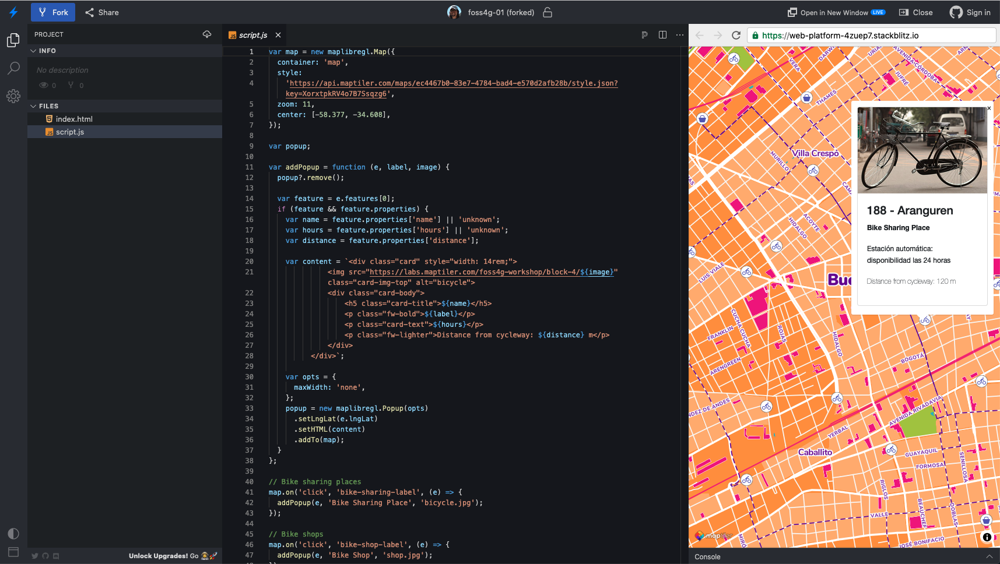

# Sample Web App Tutorial

The tutorial starts with `base.html` file in this folder.
The code is also available on StackBlitz:

- [the app this tutorial is based on](https://stackblitz.com/edit/web-platform-fhrzas?file=script.js)
- [final app](https://stackblitz.com/edit/web-platform-4zuep7?file=script.js)
  > :warning: **Expired API key**: These apps use expired API key, that was generated just for workshop purpose. Get your own at https://cloud.maptiler.com



## Use map and vector tiles prepared in the workshop.

Remove geoJSON fetch.

```js
  fetch(
    'https://api.maptiler.com/data/a9243a93-a4d3-4a6d-a8a1-d00a78a88985/features.json?key=XorxtpkRV4o7B7Ssqzg6'
  ).then((res) => {
    res.json().then((geojson) => {
      // add markers to map
      for (const { geometry, properties } of geojson.features) {
        // make a marker for each feature and add to the map
        new maplibregl.Marker().setLngLat(geometry.coordinates).addTo(map);
      }
    });
  });
```
> :warning: **Expired API key**: This API key was generated just for workshop purpose. Get your own at https://cloud.maptiler.com

Change the style URL

```js
style: 'https://api.maptiler.com/maps/b4a5f12e-9aea-4742-b767-19557ff5d0d2/style.json?key=XorxtpkRV4o7B7Ssqzg6'
```
> :warning: **Expired API key**: This API key was generated just for workshop purpose. Get your own at https://cloud.maptiler.com

## Display POI attributes

Create function for displaying popup

```js
var popup;

var addPopup = function (e) {

}
```

Remove previous popup (if any)

```js
popup?.remove();
```

Add code for displaying popup window

```js
    var content = '<h1>Hellow World!</h1>'
    var opts = {
        maxWidth: 'none'
    };
    popup = new maplibregl.Popup(opts)
        .setLngLat(e.lngLat)
        .setHTML(content)
        .addTo(map);
```

Add event handlers

```js
    // Bike sharing places
    map.on('click', 'bike-sharing-label', (e) => {
        addPopup(e);
    });

    // Bike shops
    map.on('click', 'bike-shop-label', (e) => {
        addPopup(e);
    });
```

Pass in parameters to popup function

```js
    var addPopup = function (e, label, image) {
    }
```

tweak content

```js
  var content = `<h1>Hellow World!</h1>
    
    <h4>${label}</h4>
  `;
```

```js
    // Bike sharing places
    map.on('click', 'bike-sharing-label', (e) => {
        addPopup(e, 'Bike Sharing Place', 'bicycle.jpg');
    });

    // Bike shops
    map.on('click', 'bike-shop-label', (e) => {
        addPopup(e, 'Bike Shop', 'shop.jpg');
    });
```

Style the window - add bootstrap

```html
<link href="https://cdn.jsdelivr.net/npm/bootstrap@5.1.1/dist/css/bootstrap.min.css" rel="stylesheet" />
<script src="https://cdn.jsdelivr.net/npm/bootstrap@5.1.1/dist/js/bootstrap.bundle.min.js"></script>
```

Add card control

```js
var content = `<div class="card" style="width: 14rem;">
        
        <div class="card-body">
            <h4>${label}</h4>
        </div>
    </div>`
```

Query GeoJSON attributes

```js
var feature = e.features[0];
if (feature && feature.properties) {
    var name = feature.properties['name'] || 'unknown';
    var hours = feature.properties['hours'] || 'unknown';
    var distance = feature.properties['distance'];

    var content = `<div class="card" style="width: 14rem;">
            
            <div class="card-body">
                <h5 class="card-title">${name}</h5>
                <p class="fw-bold">${label}</p>
                <p class="card-text">${hours}</p>
                <p class="fw-lighter">Distance from cycleway: ${distance} m</p>
            </div>
        </div>`

        var opts = {
            maxWidth: 'none'
        };
        popup = new maplibregl.Popup(opts)
            .setLngLat(e.lngLat)
            .setHTML(content)
            .addTo(map);
    }
}        
```

